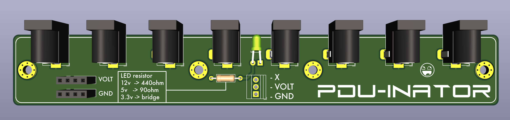

# simple-pdu-pcb
This PCB allows you to wire up eight `DC-005` horizontal barrel connectors onto a single PCB, with an optional power LED.    Silkscreen note which resistors you need for a ~3.2v green led.... didn't mention what led specs you needed.  Hum.  Anyways.

# Details
- Supply whatever voltage you need - top layer is a full copper pour for power plane, bottom layer is a full copper pour for ground plane.
- 25x170mm (_10mm gaps between barrel connectors_)
- extra breakouts for ground and power
- led + resistor through-hole mounts
- 4x M3 plated/via'd mount holes (_middle two centers are 40mm apart, outer two centers are 5mm from edge, outer to middle centers are 60mm apart_)
- 3-pin 2.54mm-spaced terminal block to connect source (_what I had on hand - 2-pin will work fine_)
- DC-005 connectors are 3.8?mm off the end of the board for flush-mounting in a 3D-printed enclosure.

# Why
As part of my long-standing 'do something about the desk wiring already' project, we take the first step: DC wiring

I have two ATX power supplies mounted to the underside of the desk right now and it's dubiously wired at best.
To remedy this, and simplify the setup, I'm moving to one PSU and some breakout boards.

Because patterns are useful, I made this pcb to work with 3.3 or 5 or 12 volts.  So I will use 3 boards - one per rail.

# Future ideas
- Having one connector type and multiple voltages is not a great design choice.
- I didn't note what kind of led needs those resistor values.
- Should have added notation on hole spacing to silkscreen.

# Schematic
